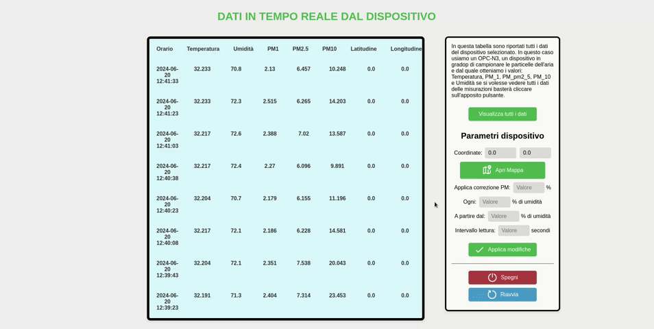

Stazione per la rilevazione della qualità dell'aria.

 

# Dettagli Repository

Questa Repository permette di replcare una stazione per la rilevazione dell'
inquinamento dell'aria utilizzando un rasberryPi 3b+, un sensore OPC N3, un 
sensore di temperatura DHT e un GPS. Una pagina web si connette al server WebSocket sul
rasberry che fornisce in tempo reale i dati dei sensori per la visualizzazione
e la crezione di grafici e mappa dei dati.

 

# Componenti

I sensori e gli altri componenti utilizzati per la stazione sono

- **RasberryPy 3b+**
- **Alimentatore 5V 2A**
- **Sensore OPC-N3**
- **Convertitore seriale usb**, per collegare l'OPC-N3 alla porta USB del rasberry
- **Sensore di temperatura e umidità DHT22**
- **GPS + BDS BeiDou Dual Module**

# Struttura Repository

- **AirStation**
- **AirStation/Web** file per la pagina Web
- **AirStation/Lettura_dati** Cartella con tutti i file python necessari per far funzionare i sensori e il server WS

# To do

lementare sia su python che sulla pagina web le funzionalità per avviare, fermare e riavviare i sensori (presente ma non funzionante)- riorganizzare completamente gli script in python e la gestione del codice
- imp
