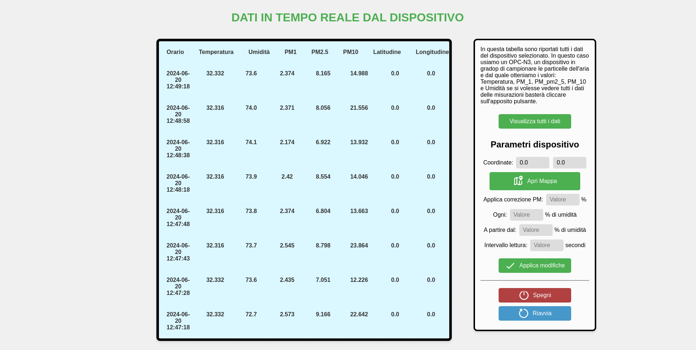
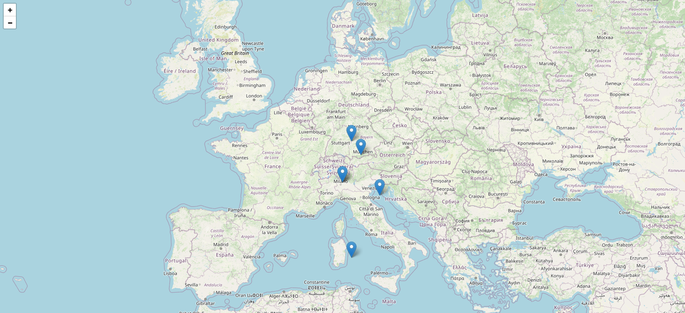
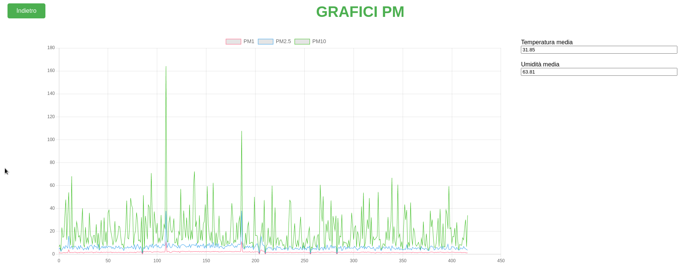

<div align="center">


Stazione per la rilevazione della qualità dell'aria.

</div>

<br />

# Dettagli Repository

Questa repository permette di replicare una stazione per la rilevazione dell'inquinamento dell'aria utilizzando un Raspberry Pi 3b+, un sensore OPC-N3, un sensore di temperatura DHT e un GPS. Una pagina web si connette al server WebSocket del Raspberry Pi che fornisce in tempo reale i dati dei sensori per la visualizzazione e la creazione di grafici e mappa dei dati.

<br />

<div>


</div>

# Componenti

I sensori e gli altri componenti utilizzati per la stazione sono:

- **Raspberry Pi 3b+**
- **Alimentatore 5V 2A**
- **Sensore OPC-N3** - per la rilevazione di particolato (PM1, PM2.5, PM10)
- **Convertitore seriale USB** - per collegare l'OPC-N3 alla porta USB del Raspberry Pi
- **Sensore di temperatura e umidità DHT22**
- **GPS + BDS BeiDou Dual Module** - per la localizzazione geografica

# Struttura Repository

- **Html/** - Contiene tutti i file per la pagina Web
  - `realTime.html` - Pagina principale con visualizzazione dati in tempo reale
  - `dati.html` - Pagina con tutti i dati del giorno selezionato
  - `mappa.html` - Visualizzazione su mappa delle rilevazioni
  - `grafico.html` - Grafici dei dati raccolti
  - File JavaScript corrispondenti per ogni pagina
  - `style.css` - Foglio di stile condiviso
- **Lettura_PM/** - Script Python per i sensori e il server WebSocket
  - `Main.py` - Script principale
  - `opc.py` - Gestione sensore OPC-N3
  - `dht.py` - Gestione sensore DHT22
  - `script_websocket.py` - Server WebSocket
  - `lettore_completo.py` - Lettura completa di tutti i sensori

# Pagina Web

<div>



</div>

## Descrizione

La pagina web è composta da una pagina principale (`realTime.html`) dove si possono vedere in tempo reale i dati ricevuti dal Raspberry Pi dopo essersi messo in comunicazione con il Raspberry Pi. 

Sulla sinistra c'è un pannello di controllo con il quale si può:
- Passare alla pagina successiva (la pagina con tutti i dati del giorno selezionato)
- Aprire la cartina
- Interagire con il server per modificare alcuni dati per le rilevazioni (non ancora implementato)

Dalla pagina dei dati è poi possibile accedere alla cartina e ai grafici. I dati vengono caricati individualmente dalla pagina interessata e per quanto riguarda la mappa e il grafico, la data del CSV da prendere per i dati viene specificata nell'URL dopo il parametro `data=`. La funzione `getUrlParameter(nome)` provvede a prendere il valore del parametro specificato.

## Struttura Web

Ogni pagina HTML ha il proprio file script.js che ha lo stesso nome della pagina (a parte `realTime.html` che ha `realTime.js`) nella cartella Html.

Tutte le pagine inoltre condividono lo stesso foglio di stile (`style.css`) nella cartella Html.

Lo script `github.js` serve per leggere i file CSV da una repository di GitHub, ma se si utilizza il web server non è necessario.

---

## Mappa



La mappa è stata realizzata utilizzando [Leaflet](https://leafletjs.com), una libreria open-source JavaScript per le mappe. I dati della mappa sono stati invece presi da [OpenStreetMap](https://www.openstreetmap.org).

```javascript
var map = L.map('map').setView([45.64203, 9.105091], 7);

// creazione della mappa
L.tileLayer('https://tile.openstreetmap.org/{z}/{x}/{y}.png', {
    maxZoom: 19,
    attribution: '&copy; <a href="http://www.openstreetmap.org/copyright">OpenStreetMap</a>'
}).addTo(map);
```

Una volta caricati i dati dal server, per ogni rilevazione sulla mappa viene creato un marker nelle coordinate esatte con i parametri di PM1, PM2.5 e PM10:

```javascript
// aggiunge i markers in ogni luogo in cui è stata fatta una misurazione
for (let i = 0; i < misurazioni.length; i++){
    if (!isNaN(misurazioni[i].latitude) && !isNaN(misurazioni[i].longitude)){
        markers[i] = L.marker([misurazioni[i].latitude, misurazioni[i].longitude]).addTo(map);
        markers[i].bindPopup("<b>PM1: </b>" + misurazioni[i].pm1 + 
                           "<br><b>PM2.5: </b>" + misurazioni[i].pm25 + 
                           "<br><b>PM10: </b>" + misurazioni[i].pm10);
    }
}
```

## Grafico



Il grafico è stato realizzato utilizzando la libreria open-source [Chart.js](https://www.chartjs.org). La funzione `createGraph(listData)` si occupa di:
- Creare gli array da disporre nel grafico
- Definire le sue caratteristiche
- Calcolare i valori di temperatura e umidità medi

Una funzione `dataAreConsistents(obj)` verifica la validità dei dati.

# To Do

- Implementare sia su Python che sulla pagina web le funzionalità per avviare, fermare e riavviare i sensori (presente ma non funzionante)
- Riorganizzare completamente gli script in Python e la gestione del codice
- Migliorare l'interfaccia utente del pannello di controllo
- Aggiungere validazione e gestione errori più robusta
